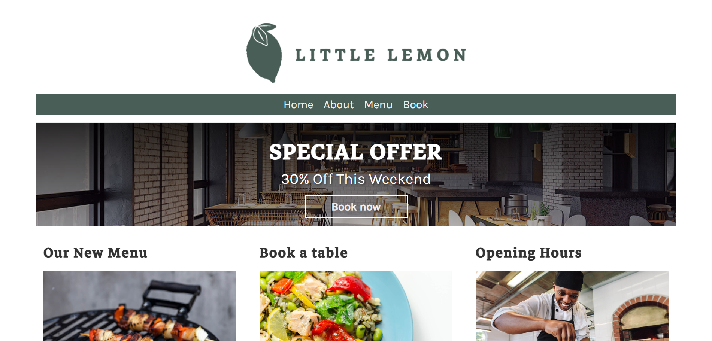
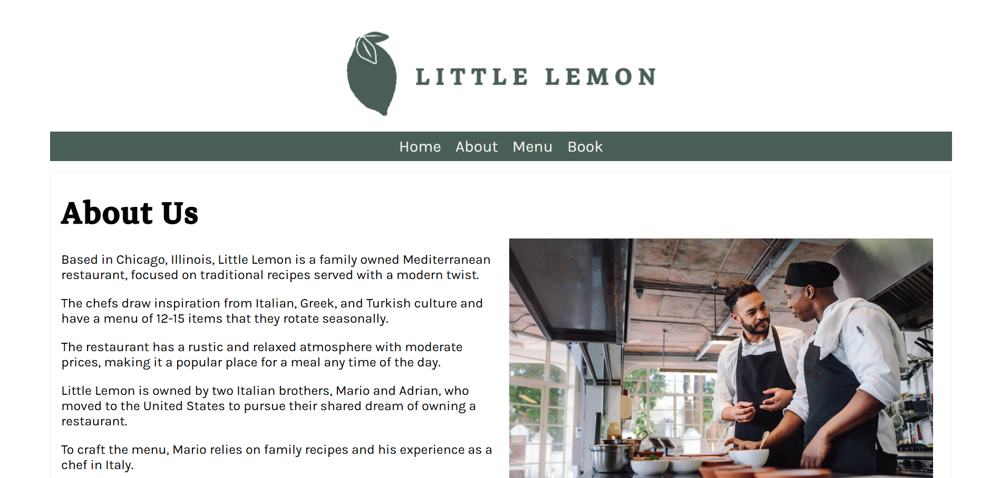
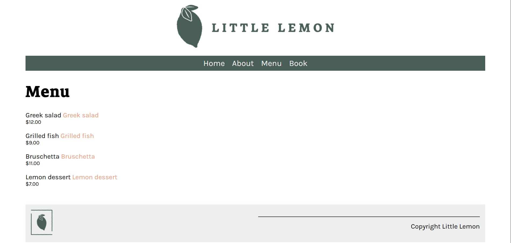
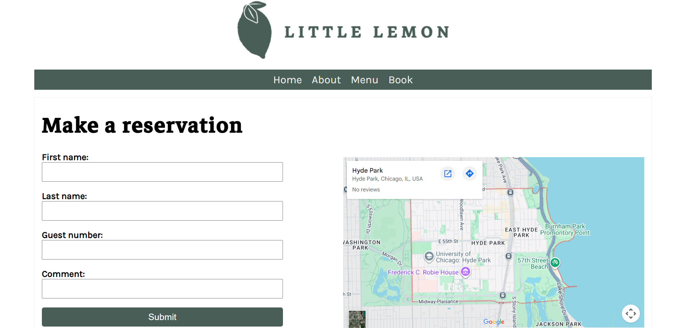

# Django Little Lemon Restaurant

A simple web app made by using Django framework. It is from meta peer-graded assignment for the fictional Little Lemon restaurant. It includes Home, About, Menu, and Book (reservation) pages with basic navigation and styling.

## How to run for Windows PowerShell
Make sure you install python and django webframework in your local machine environment.

---

1. Install dependencies:

```bash
    cd .\workplace\littlelemon
```
```bash
    python -m venv .venv
```
```bash
    .\.venv\Scripts\Activate.ps1
```
```bash
    python -m pip install Django==6.0.5
```

2. Start the dev server:
```powershell
python manage.py runserver
```

3. Open the address in browser
```powershell
http://127.0.0.1:8000/
``` 


## Overview

### Home


### About


### Menu


### Book


---

Copyright (c) 2026 Julqarnaeen Ahmed Jihad. All rights reserved.